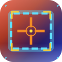

# Sightline



**Share any region of your screen in video calls**


---

## The Problem

macOS gives you exactly two screen sharing options:

1. **Share entire screen** — Unusable with ultrawide monitors. Your 3440×1440 or
   5120×1440 display gets crammed into a tiny picture-in-picture on
   participants' laptops, making everything unreadable.

2. **Share a single window** — Can't show content from multiple applications.
   Presenting a design alongside its code? Comparing two documents? Forget it.

## The Solution

**Sightline** lets you draw a rectangle around any region of your screen and
share just that. Multiple windows, any size, perfectly readable.

```text
┌─────────────────────────────────────────────────────────────────────────┐
│                          Your Ultrawide Display                         │
│                                                                         │
│  ┌───────────────┐   ┌───────────────────────────┐   ┌───────────────┐  │
│  │               │   │                           │   │               │  │
│  │               │   │  ┌─────────────────────┐  │   │               │  │
│  │     Slack     │   │  │                     │  │   │    Notes      │  │
│  │               │   │  │  Selected Region    │  │   │               │  │
│  │               │   │  │                     │  │   │               │  │
│  │               │   │  └─────────────────────┘  │   │               │  │
│  │               │   │          VS Code          │   │               │  │
│  └───────────────┘   └───────────────────────────┘   └───────────────┘  │
│                                    │                                    │
└────────────────────────────────────┼────────────────────────────────────┘
                                     │
                                     ▼
                      ┌───────────────────────────┐
                      │   Sightline Capture       │
                      │                           │  ◀── Share this window
                      │   (Selected Region)       │      in Teams/Zoom/Slack
                      └───────────────────────────┘
```

---

## Quick Start

### Installation

```bash
# Clone the repository
git clone https://github.com/mhersson/sightline.git
cd sightline

# Build and install to /Applications
./Scripts/build-app.sh --install

# Optional: auto-start on login
./Scripts/build-app.sh --install --autostart
```

### Usage

1. **Launch** — Click the Sightline icon in your menubar
2. **Select** — Choose "Select Region" and drag a rectangle over what you want
   to share
3. **Share** — In your video call, Share → **Window** → "Sightline Capture"

---

## Features

| Feature              | Description                                    |
| -------------------- | ---------------------------------------------- |
| 🎯 **Pixel-Perfect** | 1:1 capture quality, no scaling artifacts      |
| ⚡ **30 FPS**        | Smooth capture using ScreenCaptureKit          |
| 🖥️ **Multi-Monitor** | Select regions across any connected display    |
| 🪟 **Multi-Window**  | Capture content spanning multiple applications |
| 🔒 **Privacy-First** | No network access, no analytics                |
| 🪶 **Lightweight**   | Native Swift, minimal resource usage           |

---

## Requirements

- **macOS 26 (Tahoe)** or later
- **Screen Recording** permission (granted on first launch)

---

## Menubar Options

| Option                  | Action                            |
| ----------------------- | --------------------------------- |
| **Select Region**       | Pick a new screen area to capture |
| **Show Capture Window** | Bring the capture window to front |
| **Hide Capture Window** | Hide without stopping capture     |
| **Stop Sharing**        | End capture and close window      |
| **Quit**                | Exit Sightline                    |

---

## How It Works

```text
ScreenCaptureKit          IOSurface              NSWindow
       │                      │                      │
       │  Capture region      │                      │
       │  at 30 FPS           │                      │
       ▼                      ▼                      ▼
 ┌───────────┐          ┌───────────┐         ┌──────────────┐
 │  SCStream │─────────▶│  Surface  │────────▶│ CaptureWindow│
 └───────────┘          └───────────┘         └──────────────┘
               CVPixelBuffer          CGImage        │
                                                     ▼
                                              Share in call
```

Sightline captures your selected region using ScreenCaptureKit and renders it to
a standard window. Conferencing apps see this as a normal window they can
share—no hacks required.

---

## Development

```bash
# Debug build and run
swift build && .build/debug/Sightline

# Watch debug logs (default location on macOS)
tail -f ~/Library/Logs/Sightline/debug.log

# Or if using XDG_STATE_HOME
tail -f $XDG_STATE_HOME/Sightline/debug.log
```

### Project Structure

```text
Sightline/
├── Sources/Sightline/
│   ├── main.swift              # Entry point
│   ├── AppDelegate.swift       # App lifecycle
│   ├── MenuBarController.swift # Menubar UI
│   ├── SelectionOverlay.swift  # Region selection
│   ├── CaptureManager.swift    # Screen capture
│   ├── CaptureWindow.swift     # Output window
│   ├── BorderWindow.swift      # Selection border
│   └── ScreenUtilities.swift   # Coordinate helpers
├── Scripts/
│   ├── build-app.sh            # Build & install
│   └── generate-icon.swift     # Icon generator
└── Package.swift
```

---

## Tech Stack

| Component | Technology                   |
| --------- | ---------------------------- |
| Language  | Swift 6 (strict concurrency) |
| Capture   | ScreenCaptureKit             |
| Rendering | IOSurface + CGImage          |
| UI        | AppKit                       |
| Build     | Swift Package Manager        |

---

## Troubleshooting

**"Sightline Capture" doesn't appear in sharing picker**

> The capture window must be visible. Click "Show Capture Window" in the
> menubar.

**Screen recording permission dialog keeps appearing**

> Grant permission in System Settings → Privacy & Security → Screen Recording,
> then restart Sightline.

**Capture appears blurry**

> The capture window size matches your selected region exactly. For best results
> on calls, select a reasonably-sized region (e.g., 1280×720 or 1920×1080).

---

## Tips & Tricks

### Using with AeroSpace

If you use [AeroSpace](https://github.com/nikitabobko/AeroSpace) as your window
manager, add this rule to your config to automatically float the capture window
and move it to a dedicated workspace:

```toml
[[on-window-detected]]
if.app-id = 'com.github.mhersson.sightline'
run = ['layout floating', 'move-node-to-workspace 9']
```

This keeps the capture window out of your way. Note that Microsoft Teams (and
some other apps) will switch to that workspace when you start sharing, so be
ready to switch back to your main workspace.

---

## License

MIT License. See [LICENSE](LICENSE) for details.
